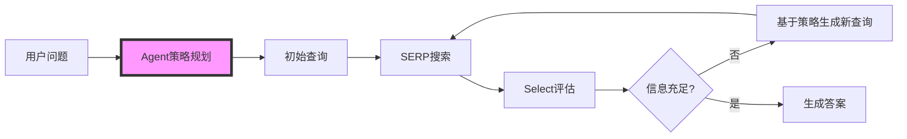

# DeepSearch v1.2 架构更新说明

## 🎯 核心优化：激活Agent策略规划

### 更新前
- agent_system.txt存在但未使用
- 搜索策略制定由SearchModel在Select阶段临时决定
- 缺乏整体规划，每轮搜索相对独立

### 更新后
- ✅ **Agent在搜索开始前制定整体策略**
- ✅ **明确的职责划分**
- ✅ **策略指导下的迭代搜索**

## 📋 优化后的Prompt职责划分

### 1. **agent_system.txt** - 整体策略规划 🆕
- **时机**: 搜索工作流开始前
- **职责**: 
  - 分析问题本质和挑战
  - 制定2-3步搜索计划
  - 生成优化的初始查询
  - 预估搜索轮数
- **输出格式**:
```xml
<strategy>
  <analysis>问题分析和主要挑战</analysis>
  <search_plan>整体搜索计划</search_plan>
  <initial_query>{"query": "优化的搜索查询"}</initial_query>
  <estimated_rounds>3</estimated_rounds>
</strategy>
```

### 2. **searchmodel_system.txt** - 核心能力定义
- **时机**: 作为SearchModel的系统提示
- **职责**: 定义SearchModel的能力边界，不直接参与决策

### 3. **select_evaluation.txt** - 轮次评估决策
- **时机**: 每轮搜索后
- **职责**: 
  - 基于Agent策略评估结果
  - 参考搜索历史避免重复
  - 生成下一轮精确查询
- **新增输入**:
  - 整体搜索策略
  - 搜索历史记录

### 4. **content_extraction.txt** - 信息提取
- 职责不变，从网页提取关键信息

### 5. **synthesize_system.txt** - 最终生成
- 职责不变，生成结构化分析报告

## 🔄 优化后的工作流



## 💻 代码实现

### 1. 新增方法
```python
async def plan_search_strategy(self, question: str) -> Dict[str, Any]:
    """使用Agent制定整体搜索策略"""
    
def extract_search_strategy(self, agent_response: str) -> Dict[str, Any]:
    """从Agent响应中提取策略"""
```

### 2. 工作流集成
- 在execute_deepsearch_workflow开始时调用plan_search_strategy
- 使用Agent策略的initial_query作为第一轮搜索
- 传递策略和历史给select_phase

### 3. Select阶段增强
- 接收search_strategy和search_history参数
- 在评估时考虑整体策略
- 避免重复搜索

## 📊 实际效果

测试问题："特斯拉最新财报的关键数据"

**Agent策略输出**:
- 分析：识别时效性需求、数据权威性、关键指标
- 初始查询：`Tesla Q1 2025 earnings report filetype:pdf site:ir.tesla.com`
- 预计轮数：3

**优势**:
1. 🎯 **更精准的初始查询** - 直接使用site:和filetype:
2. 📋 **有计划的搜索** - 不是盲目尝试
3. 🔄 **更好的迭代** - 基于整体策略调整

## 🚀 后续优化建议

1. **领域特定策略模板**
   - 为财务、技术、学术等领域创建专门的策略模板
   
2. **策略学习机制**
   - 记录成功的搜索策略
   - 逐步优化Agent的策略制定

3. **动态策略调整**
   - 根据搜索进展动态调整策略
   - 提前终止或延长搜索

## 📝 总结

通过激活agent_system.txt并明确各prompt职责，DeepSearch v1.2实现了：
- ✅ 从"被动搜索"到"主动规划"
- ✅ 从"独立轮次"到"策略指导"
- ✅ 从"功能重叠"到"职责明确"

这标志着DeepSearch向真正的智能搜索系统迈进了重要一步。