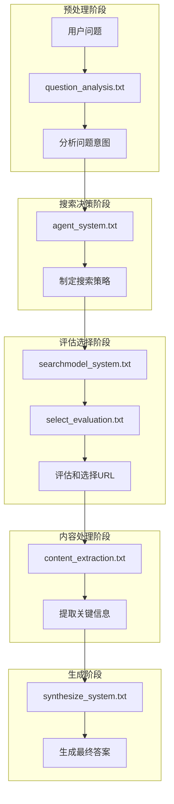

# v1.2 Prompt 使用规划详解

## 📁 Prompt文件结构

```
/prompts/deepsearch/versions/v1.2/
├── agent_system.txt              # DeepSearch Agent系统提示（暂未使用）
├── agent_system_improved.txt     # 改进版Agent系统提示（暂未使用）
├── content_extraction.txt        # 内容提取提示词
├── question_analysis.txt         # 问题分析提示词
├── searchmodel_system.txt        # SearchModel系统提示 ✨新增
├── select_evaluation.txt         # 选择评估提示词
└── synthesize_system.txt         # 综合生成系统提示
```

## 🔄 Prompt使用流程图



## 📝 各Prompt详细用途

### 1. **question_analysis.txt** - 问题分析
- **用途**: 分析用户问题的潜在需求
- **调用时机**: 工作流开始前（可选）
- **主要功能**:
  - 识别问题类型（事实查询/分析/建议等）
  - 判断时间敏感性
  - 确定所需信息类型
- **代码位置**: `analyze_question()`方法

### 2. **agent_system.txt** - Agent系统提示 ⚠️
- **状态**: v1.2中暂未使用
- **原设计用途**: DeepSearch Agent的核心决策逻辑
- **包含内容**:
  - 搜索策略制定技巧
  - 迭代搜索流程
  - 输出格式定义
- **注**: 目前其功能被`select_evaluation.txt`承担

### 3. **searchmodel_system.txt** - SearchModel系统提示 ✨
- **用途**: SearchModel的核心能力定义
- **调用时机**: Select阶段
- **主要功能**:
  - 定义搜索策略制定能力
  - 信息源评估标准
  - 迭代搜索决策原则
- **代码位置**: `select_phase()`方法第693行

### 4. **select_evaluation.txt** - 选择评估
- **用途**: 评估搜索结果并决定下一步
- **调用时机**: 每轮搜索后的Select阶段
- **主要功能**:
  - 评估候选网页价值
  - 选择Top 3 URL
  - 决定是否继续搜索
  - 生成下一轮搜索查询
- **代码位置**: `select_phase()`方法第683行
- **模板参数**:
  - `{time_context}` - 时间上下文
  - `{question}` - 用户问题
  - `{previous_knowledge}` - 已获取的知识
  - `{num_results}` - 搜索结果数
  - `{formatted_info}` - 格式化的搜索结果

### 5. **content_extraction.txt** - 内容提取
- **用途**: 从爬取的网页中提取关键信息
- **调用时机**: Crawl后的Extract阶段
- **主要功能**:
  - 根据问题目标提取相关内容
  - 结构化组织信息
  - 压缩冗余内容
- **代码位置**: `extract_single_content()`方法第545行
- **模板参数**:
  - `{time_context}` - 时间上下文
  - `{question}` - 用户问题
  - `{url}` - 网页URL
  - `{title}` - 网页标题
  - `{task_context}` - 任务上下文
  - `{content}` - 网页内容

### 6. **synthesize_system.txt** - 综合生成系统
- **用途**: Generation Model的系统提示
- **调用时机**: Synthesize阶段
- **主要功能**:
  - 深度理解问题诉求
  - 整合多源信息
  - 生成结构化报告
- **代码位置**: `synthesize_phase_with_structured_output()`方法第838行

### 7. **agent_system_improved.txt** - 改进版Agent ⚠️
- **状态**: 备用版本，暂未使用
- **设计目的**: 作为agent_system.txt的优化版本

## 🔧 实际使用情况

### ✅ 正在使用的Prompt:
1. **searchmodel_system.txt** + **select_evaluation.txt** - 核心搜索决策
2. **content_extraction.txt** - 信息提取
3. **synthesize_system.txt** - 最终生成
4. **question_analysis.txt** - 问题分析（可选）

### ⚠️ 未使用的Prompt:
1. **agent_system.txt** - 原设计的Agent系统提示
2. **agent_system_improved.txt** - 改进版Agent提示

## 🎯 设计理念

### 1. **模块化设计**
- 每个Prompt负责特定功能
- 便于单独优化和A/B测试
- 支持灵活组合

### 2. **版本化管理**
- 通过PromptManager统一管理
- 支持版本切换和回退
- 便于迭代优化

### 3. **模板化支持**
- 使用`{}`占位符
- 动态注入上下文信息
- 保持Prompt的通用性

### 4. **时间感知**
- 所有Prompt都支持`{time_context}`
- 提供实时的时间信息
- 增强时效性判断

## 💡 优化建议

1. **激活agent_system.txt**
   - 可以考虑在搜索开始时使用
   - 让Agent制定整体搜索策略
   - 与SearchModel形成分工

2. **整合重复功能**
   - agent_system.txt和select_evaluation.txt有部分重叠
   - 可以更明确地划分职责

3. **增加领域特定Prompt**
   - 针对财务、技术、学术等领域
   - 提供专门的搜索策略模板

4. **完善Prompt链路**
   - 确保每个阶段都有对应的Prompt
   - 避免硬编码的系统提示

## 📊 使用统计

根据代码分析，v1.2的Prompt使用频率：
1. **select_evaluation.txt** - 每轮搜索1次（最高频）
2. **content_extraction.txt** - 每个爬取的URL 1次
3. **searchmodel_system.txt** - 每轮搜索1次
4. **synthesize_system.txt** - 每个问题1次
5. **question_analysis.txt** - 每个问题1次（可选）